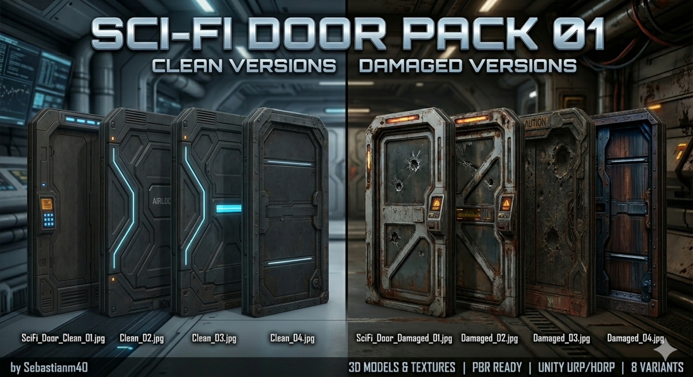
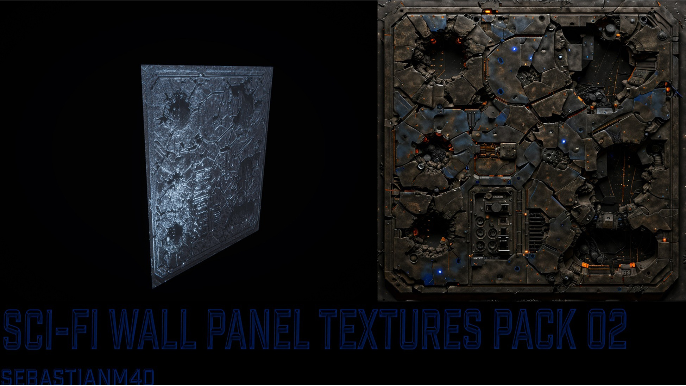
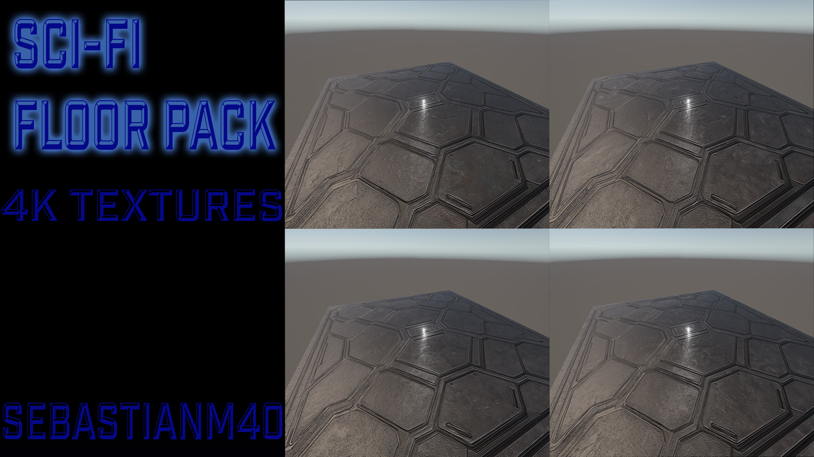
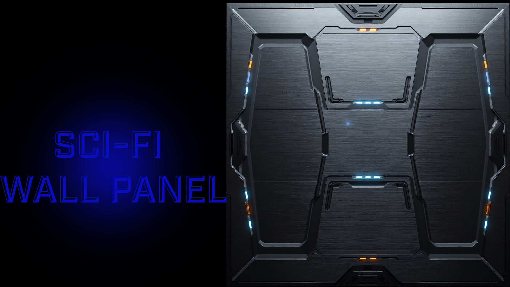

# Sci-Fi PBR Textures by Sebastianm40

Free samples & full catalog of my sci-fi PBR texture packs.
Dark gunmetal, neon accents, PBR ready, Unity URP/HDRP.

---

## ⬛ Sci-Fi Wall Panel Pack 03 (Dark Industrial)
Clean + Damaged variants, 4K, PBR, Emission maps included.
📹 [Video] https://youtu.be/HQw_HC2v2LA · [itch.io](https://sebastianm40.itch.io/sci-fi-wall-panel-textures-pack-03) · [ArtStation] https://sebastianm40.artstation.com/projects/Ao9EEq

---

## 🚪 Sci-Fi Door Pack 01

8 variants (4 Clean + 4 Damaged), 4K, PBR.
🎬 [Video](https://www.youtube.com/watch?v=b4FaE09TG6U) · [Fab](https://www.fab.com/listings/024dac0b-5bcd-4533-8beb-9b050fe2ffa9) · [itch.io](https://sebastianm40.itch.io/sci-fi-door-pack-01) · [ArtStation](https://www.artstation.com/artwork/JryPZR)

---

## 🧱 Sci-Fi Wall Panel Pack 02

4K textures, PBR, damaged variants.
[Fab](https://www.fab.com/listings/eaf8124f-6d21-43bb-922d-a02df99d27ba) · [itch.io](https://sebastianm40.itch.io/sci-fi-wall-panel-textures-pack-02) · [Unity](https://assetstore.unity.com/packages/2d/textures-materials/sci-fi-wall-panel-textures-pack-02-385036) · [ArtStation](https://www.artstation.com/artwork/6LKo8x)

---

## 🟦 Sci-Fi Floor Panel Pack 01

Hexagonal floor panels, 4K, PBR.
[Fab](https://www.fab.com/listings/18ab2dbf-4363-4244-9233-7f2f0fa3f338) · [itch.io](https://sebastianm40.itch.io/sci-fi-floor-panel-textures-pack-01) · [Unity](https://assetstore.unity.com/packages/2d/textures-materials/scifi-floor-texture-pack-vol-01-384232) · [ArtStation](https://www.artstation.com/artwork/oJngmm)

---

## ▪️ Sci-Fi Wall Panel 01

Single sci-fi wall panel, PBR.
[Fab](https://www.fab.com/listings/2330b6ef-f328-42e4-a56a-59805a9f9f63) · [itch.io](https://sebastianm40.itch.io/sci-fi-wall-panel-01) · [ArtStation](https://www.artstation.com/artwork/kNA0J6)

---

More: [Fab store](https://www.fab.com/sellers/Sebastianm40) · [itch.io](https://sebastianm40.itch.io) · [YouTube](https://www.youtube.com/watch?v=b4FaE09TG6U)

*Textures created with AI-assisted tools. License: CC-BY 4.0.*
